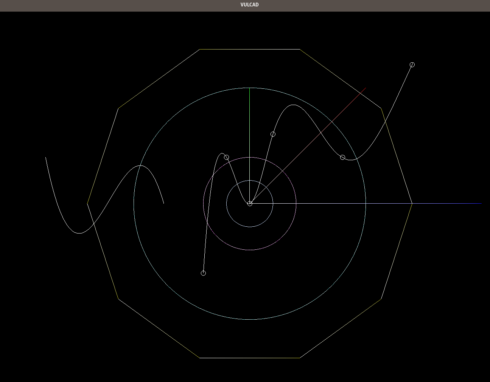

# VULCAD

2D CAD for pattern making written in c++ with vulkan



## Features

- supported shapes
  - line
  - point
  - circle and any polygons
  - bezier curve
  - spline and any polylines
- cross-platform viwer powered by Vulkan API
- save drawings as dxf files (Drawing Exchange Format. the most common file format for CAD applications)
- matrix and vector calculations
- simple and fast cmake commands

## Usage

sample code for drawing line

```
// create a line
Line l({0, 0}, {2, 3});
// draw the line
Drawing drawing;
drawing.draw(line);
// display the drawing on the screen
drawing.show();
```

build and run the program

```
$ make run
```

another example to draw other shapes

```

Bezier quodraticBezier({
    {0, 0}, // origin
    {.2, .3}, // control
    {.5, -.8}  // end
});
Bezier cubicBezier({
    {0, 0}, // origin
    {.1, -.2}, // control 1
    {.3, .5}, // control 2
    {.5, .1}  // end
});

Drawing drawing;
drawing.draw(quodraticBezier);
drawing.draw(cubicBezier, {0, 0, 255}); // second parameter is the RGB color

Circle circle(
    {}, // origin ({} is equal to {0, 0})
    .5, // radius
);

drawing.draw(circle, {0, 50, 0}); // green circle
drawing.draw(circle, {0, 10, 50}, 5); // 3rd parameter is precision. this means draw the circle with 5 lines, thus the result is the pentagon.
drawing.draw(circle, {0, 10, 50}, 3); // triangle
drawing.draw(circle, {0, 10, 50}, 4); // square
drawing.draw(circle, {0, 10, 50}, 18); // polygon with 18 vertices and edges

Spline spline({
    {}, // origin (again, {} is short hand for {0, 0})
    {.1, .2}, // 2nd point
    {.2, .12}, // 3rd
    {.3, .-1}, // 4th
    {.4, .02}, // 5th
    {.5, -.8} //end (there is no limit to number of points)
});
drawing.draw(spline); // just draw the spline

drawing.draw(spline, {100, 100, 0}); // yellow

drawing.draw(spline, {100, 100, 0}, 3);
// 3rd parameter is the precision. spline is set of 5 cubic curves that join the the above 6 points smoothly. if precision is 3, then each cubic curve is approimated by 3 lines, thus outcome looks like a line chart.

drawing.draw(spline, {100, 100, 0}, 1);
// if the precision is 1, then the each curve is now approximated a single straint line, that is a polyline.

drawing.draw(cubicBezier, {0, 255, 0}, 2); // bezier  also accepts precision

// remember to call show function to actually render the screen
drawing.show();

// save drawing as dxf files in dxf directory
Dxf::write("your-drawing", spline);
```

## Progress and Goals

in order of priority

- [x] render vertices
- [] change units in centimeter
- [x] draw lines
- [x] draw circles
- [x] export as dxf ([samples](dxf))
- [x] draw spline
- [x] draw bezier curves
- [] create base pattern
- [] create black shirts
- [] create gray jeans
- [] create black round tyrolean
- [] zoom
- [] pan
- [] documentation

## Disclaimer

- No user interface
- need to install vulkan and related libraries to use this program. look at makefile
